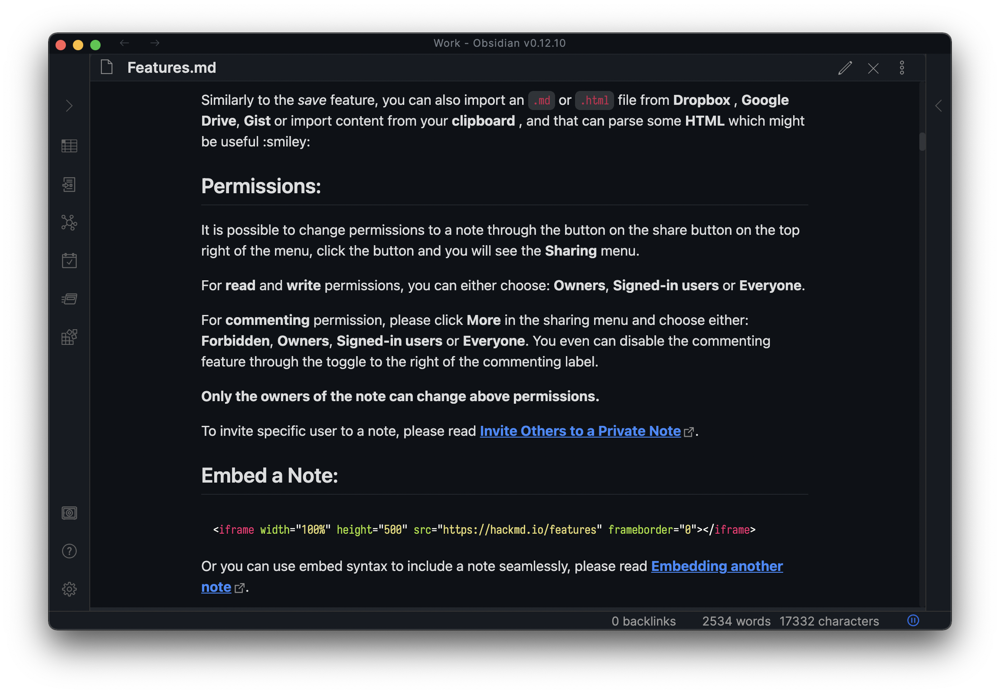

# Primer theme for Obsidian

WIP WIP WIP

## Screenshots

|                       Dark                        |                        Light                        |
| :-----------------------------------------------: | :-------------------------------------------------: |
|      |      |
|    |    |
|  |  |

## Development

Setup & Build:

```bash
yarn

yarn watch # or yarn build for production
```

Then link the theme styles to obsidian vault directory:

```bash
ln -s ./dist/theme.css ./vault/.obsidian/theme.css
```

And load it with CSS Snippet.

## References

Workspace opened links:

- [VSCode Theme](https://github.com/primer/github-vscode-theme/blob/master/src/theme.js)
- [HyperMD overwrites](https://github.com/laobubu/HyperMD/blob/master/theme/hypermd-light.scss)
- [Primer primitives](https://primer.style/primitives/)
